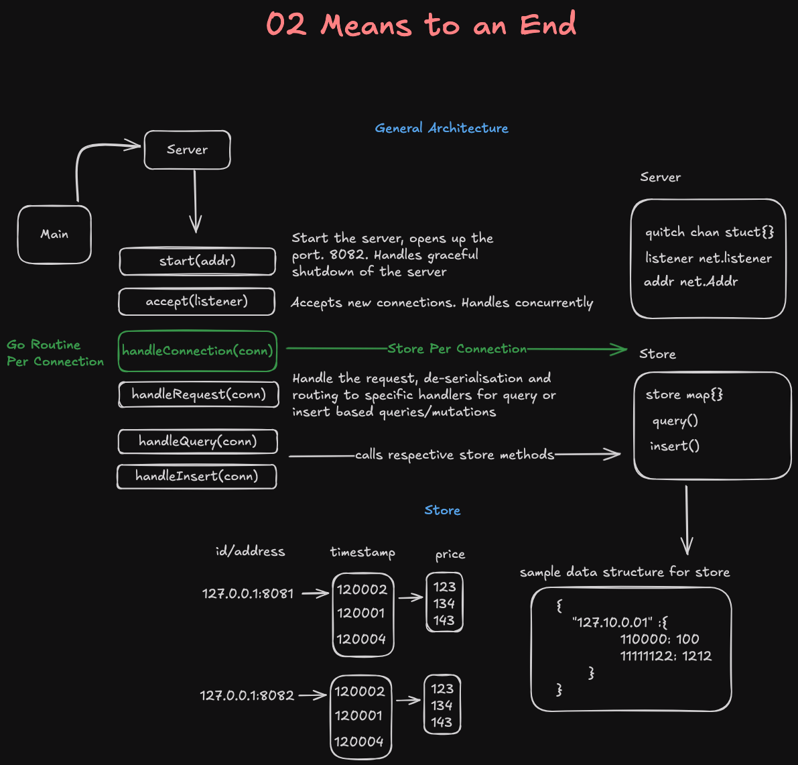

# 2: Means to an End
https://protohackers.com/problem/2

## General Architecture:



## Local Test Commands
This goes through the test sequence in the example session
```sh
(
    printf '\x49\x00\x00\x30\x39\x00\x00\x00\x65'  # I 12345 101
    printf '\x49\x00\x00\x30\x3a\x00\x00\x00\x66'  # I 12346 102
    printf '\x49\x00\x00\x30\x3b\x00\x00\x00\x64'  # I 12347 100
    printf '\x49\x00\x00\xa0\x00\x00\x00\x00\x05'  # I 40960 5
    printf '\x51\x00\x00\x30\x00\x00\x00\x40\x00'  # Q 12288 16384
) | nc -4 -q -1 localhost 8082
```
- Note: Handling of the binary data from the nc + printf is different given it sends the data in byte form 
- while server would be sending in binary protocol format

### Useful Links
- [NC with Sending Binary Data](https://www.baeldung.com/linux/netcat-sending-binary-data-established-connection) 
- [Encoding data wth the go Binary Package](https://medium.com/learning-the-go-programming-language/encoding-data-with-the-go-binary-package-42c7c0eb3e73) 

- Each client tracks the price of a different asset. Clients send messages to the server that either insert or query the prices.
- Each connection from a client is a separate session. Each session's data represents a different asset, so each session can only query the data supplied by itself.

Message Format:
- 9 bytes long - 72 bits
- 1st byte is indentifier  - in ASCII endcoding
- 2nd and 3rd segmetns of each 4bytes is in two complement 32 bits integer conversion

## Takeaways:
- Using `buf := make([]byte, 2048)` vs `bufio.NewReader`: In the PROTO-1 implementation, I used `bufio.NewReader`, but the decision to use a simple byte `buffer` `([]byte)` in subsequent implementations was made due to the nature of the incoming data. In PROTO-1, the data was JSON, which included new lines and general delimiter capabilities, making `bufio.NewReader` appropriate. However, for the binary data being received later, a low-level byte buffer provided better control.

    - Low-level Reading: This method offers more control but requires manually handling all the details, like splitting the incoming data into meaningful chunks (e.g., lines, messages, etc.).

- Sending Binary Data: Sending binary data is more complicated than processing it. Binary data must be sent in byte form, not as ASCII binary strings (which would occur if you input 100101 into the nc console).

    - Sending the string 100101 would transmit the ASCII codes for those digits.
    Example: "01000001" (binary string for the letter 'A') would send the bytes 0x30, 0x31, 0x30, 0x30, 0x30, 0x30, 0x30, 0x31 (ASCII for "01000001").
    Instead, to send the actual byte 0x41 (representing 'A'), you would use:
    `printf '\x41\x00\x01\xE2\x40\xFF\xF3\xF6\x1C' | nc <server-ip> <port>.`

- Binary Decoding in Protohacker Test Suite: During initial testing, the suite seemed to decode the binary incorrectly. I assumed incoming data was in byte form, but it was actually arriving as individual binary bits.

    - For instance, if the client sent 10100110000, it was received as 100110 0 0 0, which resulted in 9 bytes, but each zero was interpreted as a single byte (8 bits).
    printf sends binary bits in byte form to nc, which worked in those situations.
    - However, not all TCP clients send data in byte form.
    The main issue was how to handle data at the bit level, given that TCP transmits data in byte form on the network level.
    - After thorough research, the solution was found in the encoding/binary package and its Read() method.
    The previous implementation of `conn.Read()` read in byte form, leading to incorrect decoding.

- Two's Complement System: The two's complement system is used in computing because it simplifies the representation and arithmetic operations on signed integers:

    - Positive numbers are converted normally.
    Negative numbers are converted by inverting the bits and adding 1.
    This allows the same addition circuitry to be reused for both addition and subtraction.

- Conversion to Two's Complement:
    - This is particularly interesting because it assumes the data is in big-endian format, meaning the most significant byte (MSB) comes first.
    In big-endian systems, the most significant byte (e.g., 0x12) is stored at the lowest memory address.
    - I used the binary package to handle combining 4 bytes into a 32-bit integer. Internally, it shifts the bits to their respective positions in the 32-bit size, then applies the OR operator.
    Type casting the result to int32 automatically handles the conversion to two's complement.

- Avoiding Data Races: Data races could occur when a shared map is accessed by multiple goroutines.
    - You can prevent this by using a mutex or sync.Map.
    - However, I opted for a more secure-by-design approach:
    - Instead of sharing a map across connections, I create a new map per connection, tracking the connection-specific state.
    - When a connection ends (and the corresponding goroutine exits), the session-specific state is cleaned up. This was an intentional design feature.

- Handling Large Data (Data Size Issue): When calculating the sum for determining the mean value, I had to switch from int32 to int64. This solved a significant bug when dealing with large numbers of input insertions and price values, which had caused an overflow.
    - int32 can only handle values in the range of -2,147,483,648 to 2,147,483,647. While inputs fit within this range, the sum of these values often exceeded int32 limits, leading to overflow errors.

# Further Improvements

- More use of go bench functionality
- Unit Tests
- Improved Logging and way to disable in production cases
