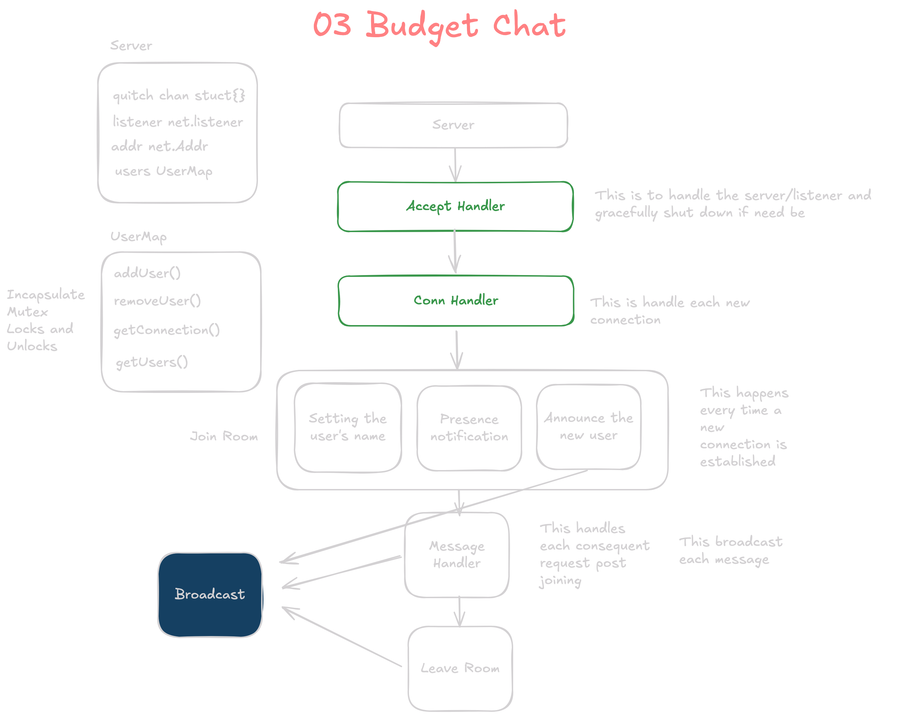

# 3: Budget Chat  
[Protohackers - Budget Chat Problem](https://protohackers.com/problem/3)

## Design

- **Key Design Considerations:**
  Three main design approaches were considered for handling connections and events:

### 1. Simple Connection Handling
   - **Design:** Use a single `handleConnection` function to handle each request and connection.
   - **Pros:** Straightforward implementation.
   - **Cons:** Requires managing a client map and using mutexes to prevent data races.

### 2. Event-Based Architecture
   - **Design:** Implement an event-driven structure with three primary event types: `Join`, `Leave`, and `Message`. A single channel processes these events, and an event dispatcher routes each event type to its respective handler.
   - **Pros:** Flexible for future expansion with additional event types.
   - **Cons:** Adds complexity for a simple application and requires mutexes for concurrency control.

### 3. Aggressive Event-Based Structure
   - **Design:** Each client has its own channel for receiving and sending messages. A common broadcaster with a central broadcast channel handles routing and determining the target channel/user for each message.
   - **Pros:** Eliminates the need for mutexes, making it secure by design.
   - **Cons:** More complex to manage.

 

### Useful Links
- [Go bufio package documentation](https://pkg.go.dev/bufio)

## Takeaways
- **Data Race Prevention:** Always consider data races (e.g., `sync.Mutex`).
- **Centralized Mutex Handling:** Abstract mutex usage in a centralized location to avoid deadlocks and unlock errors.
- **Buffered I/O vs. Manual Buffer:** Decide between `Scanner` and manual buffer implementation with `Read()`. In this case, using `bufio.Scanner` was appropriate since ASCII character delimiters allowed efficient buffered I/O for reading from the connection.
