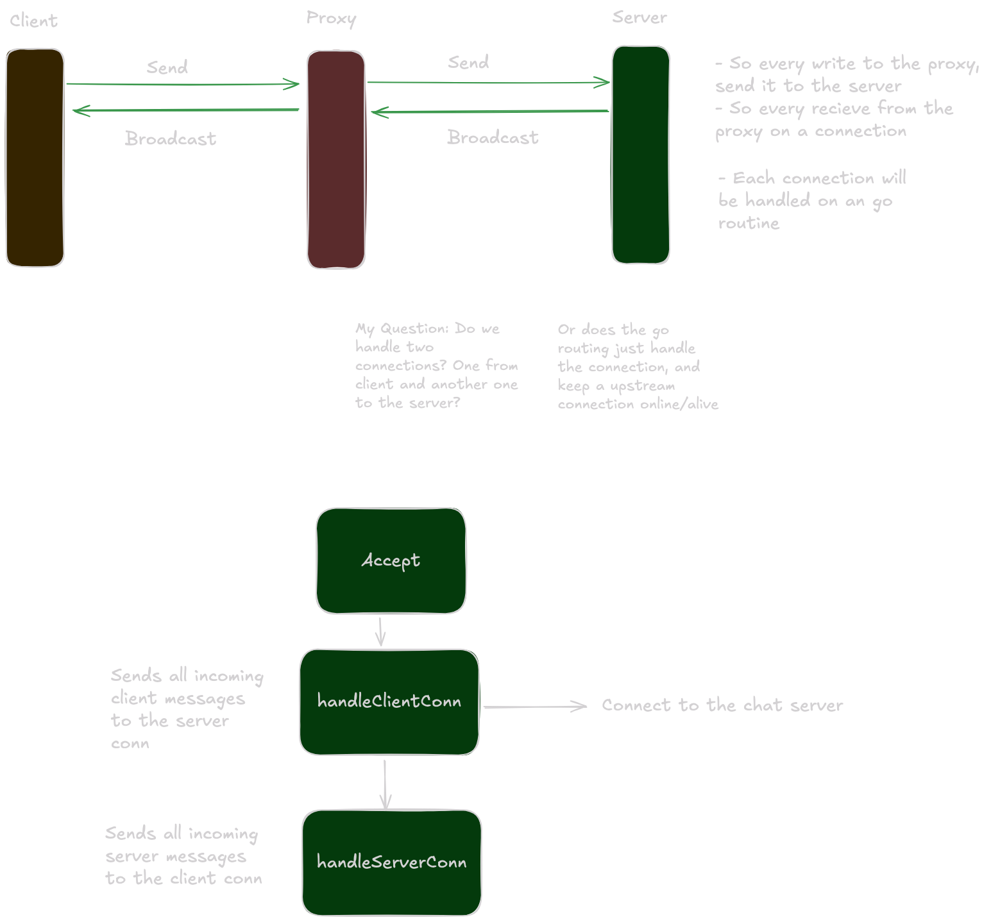

# 5: Mob in the Middle
[Protohackers - Mob in the Middle](https://protohackers.com/problem/5)

## Takeaways
- Format Flag `%q` is a LIFESAVER! Prints all the newline encoding rather than rendering the newline
- Look into Go routine proper graceful contextual termination
